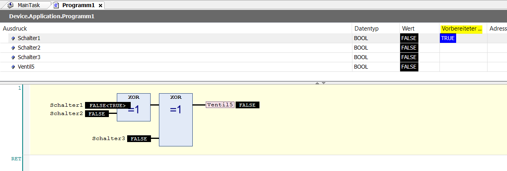
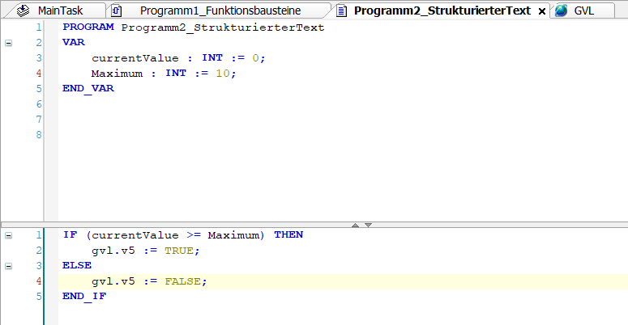
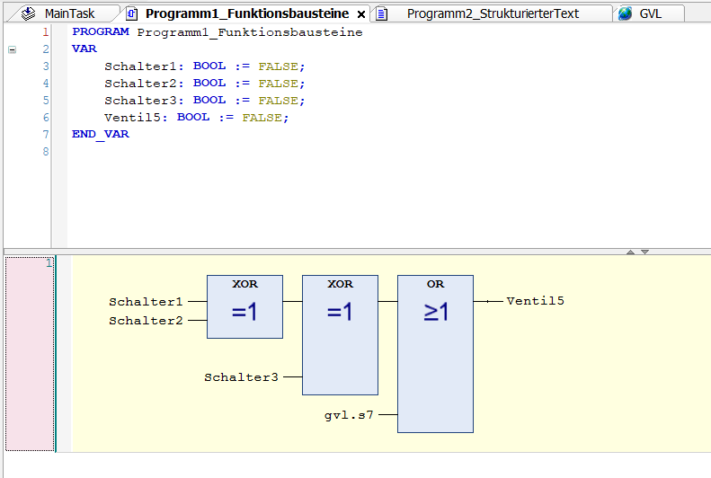
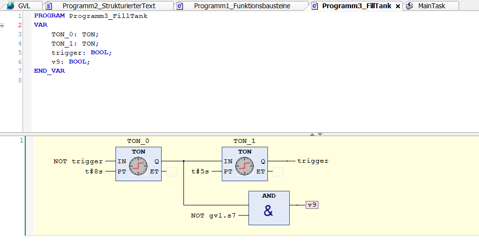
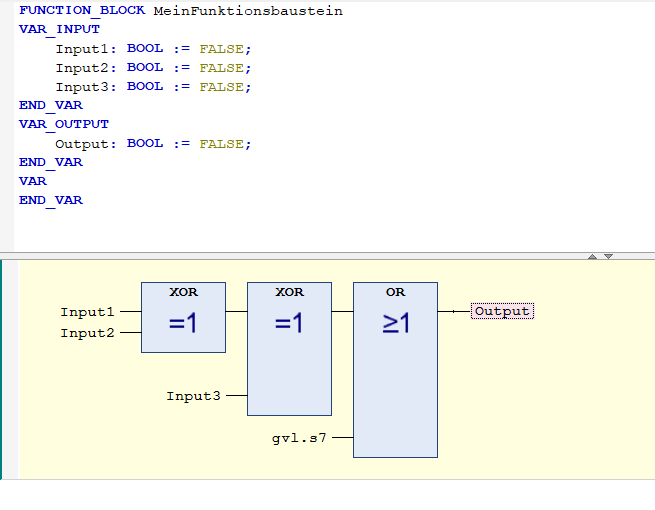
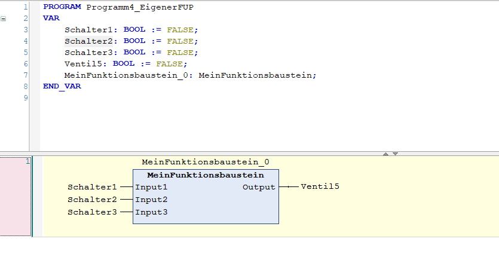
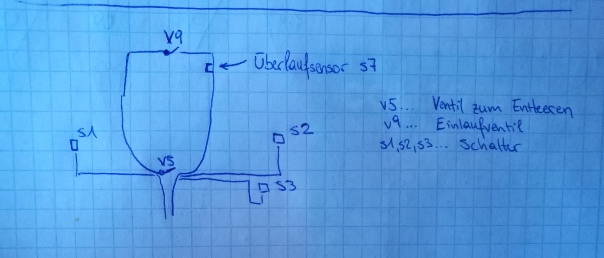

Mario Fentler 5CHIT
# syt5-gk911-industrielle-programmierung

## __Einleitung__
In diesem Repository wird die Aufgabendurchführung der Ersten Aufgabe "Tankentleerung" dokumentiert.

## __Vorraussetzung__
- CodeSys 3.5

## __Aufgabenstellung__
Die Aufgabenstellung ist auf E-Learning

## __Arbeitsschritte__
### __Neues Projekt erstellen__ 
In CodeSys wird als erster Schritt ein neues Standardprojekt erstellt. Als Gerät wird __"CODESYS Control Win V3"__ ausgewählt. Dieses ist eine sogenannte Software Solution und rennt daher nur virtuell auf der Maschine. Als Programmiersprache wird für den ersten Task __"Funktionsbausteine"__ ausgewählt.  

Nun wird man mit einer neuen Arbeitsumgebung konfrontiert. Diese sieht so aus:  

    

  
  
Was hier markiert ist sind folgende Dinge:  
- PLC_PRG ... steht für ein Programm  
- Programme laufen nur, wenn man sie in einem Task, hier MainTask, aufruft.

 

### __Tasks__
Tasks sind Dinge, die von der Hardware dann ausgeführt werden. Diese rufen Programme auf.  
Tasks können zyklisch immer wieder aufgerufen werden, solange die Hardware eingeschalten ist/Strom hat.  

In einem Task können beliebig viele Programme aufgerufen werden, allerdings muss man bedenken, dass, sobald die Zyklus-Zeit abgelaufen ist, der Task wieder von vorne beginnt. Daher kann es sein, dass Programme, die erst ziemlich spät im Task vorkommen, gar nicht aufgerufen werden.  

Programme kann man zu Tasks __hinzufügen__ entweder per Drag-and-Drop oder, indem man im Task auf den Button __"Aufruf hinzufügen"__ drückt.

    

  

### __Neue Programme hinzufügen__
Um ein neues Programm zu Erstellen klickt man mit der rechten Maustaste auf __"Application"__, __"Neues Objekt"__, __"POU"__.  
Im nächsten Fenster wählt man den Bulletpoint "Programm" und die gewünschte Programmiersprache aus.  

#### __Variablen__
Variablen können im Programm über den Baustein "Zuweisung" erstellt werden. Wenn man dort dann einen Variablennamen angibt, den es noch nicht gibt, wird man dann gleich gefragt ob man eine neue Variable hinzufügen möchte.  

Alternativ kann man das natürlich auch gleich im Code machen, was schneller geht. Man kann diesen Variablen auch einen Initialisierungswert geben.  

    

  

### __Task 1 - Anlagensteuerung mit FUP (Funktionsbausteinen)__
_Ein Tank soll über drei an verschiedenen Orten angebrachten Schaltern S1, S2, S3 entleert werden können. Das Ventil V5 zum Entleeren soll dabei von jedem Schalter ein und ausgeschaltet werden können (Funktionsweise wie bei einer Kreuzschaltung in der Elektrik, Kreuzschaltung = Wechselschaltung mit drei Schaltern)._  

_Das Programm soll in einen zyklischen Task mit einer Zykluszeit von 400ms eingebettet werden._

#### __Durchführung__
Die Zykluszeit kann man beim Task einstellen, wie oben beschrieben.  
Für die Schaltung mit den 3 Schaltern werden einfache XOR-Elemente verwendet. (Nur wenn die die beiden Eingänge unterschiedlich sind wird True zurück gegeben).  

Die Schaltung kann dann so aussehen:  

    

  
Der gelbe Bereich, den man hier sieht wird "Netzwerk" genannt.  

  

### __Programm testen__
Um das Programm zu testen muss man sich mit einem Gerät verbinden. Da wir keines besitzen, wird nun eine Simulation erstellt.  
-> "Online/Simulation"  
Anschließend "Online/einloggen" (ALT+F8)  
Alternativ kann man für's einloggen auch den Button mit dem Zahnrad verwenden. Nachdem man eingeloggt ist, kann man über den Playbutton (F5) das Programm starten.  

#### __Programmänderungen zur Laufzeit__
In diesem Programm kann man nun einen Schalter ein/ausschalten in dem man den Boolean Wert ändert.  
Bei den Programmen ist es so, dass man zuerst den Variablen einen vorbereiteten Wert gibt. Das macht man, damit man mehrere Änderungen gleichzeitig machen kann. (Die Laufzeit der Tasks sind nur ein paar Millisekunden)  

    

  

In diesem Fall ändere ich den Wert eines Schalters von False auf True. Um diese __Änderungen wirksam__ zu machen klickt man mit der rechten Maustaste auf "Application" und wählt __"Alle Werte von ... schreiben"__.  

    

  
Daraufhin ändern sich die Werte und das Ventil5 wird auf True gesetzt (aufgemacht).  

    

  

### __Task 2:__  
_Erweitere das Projekt mittels Strukturiertem Text (ST) um folgende Funktion: Zwecks Überlaufschutz wird ein digitaler Sensor S7 verbaut, der bei einer per Variable einstellbaren Maximalfüllhöhe des Tanks ein Signal liefert._

_Sollte dieser ansprechen, so muss das Ventil V5 umgehend geöffnet werden. Liefert S7 kein Signal mehr, soll das Ventil (einfache Variante) unabhängig von S1,S2,S3 geschlossen werden oder alternativ der vorherige Zustand wiederhergestellt werden (komplexere Variante)._  
_Vermeide dabei mögliche Kollisionen mit der Funktion aus Aufgabe 2._

#### __Globale Variablen__
Für diesen Task wird eine globale Variable notwending sein, da man auf diese Variable aus zwei Programmen zugreifen muss.  
Um eine globale Variable hinzuzufügen, muss man zuerst eine Global-Variablen-Liste hinzufügen -> Rechtsklick auf Applikation/Objekt hinzufügen / GVL. Dort kann man sie dann hinzufügen.

    VAR_GLOBAL
	    v5 : BOOL;
    END_VAR
__Zugriff mittels "listenname.globalVariableName"__

### __Lösung Task 2:__
Es werden zwei normale Variablen currentValue und maximum eingefügt. Anschließend wird mit einem einfachen If-Statement abgefragt ob die currentValue >= der maxvalue ist. Sofern das so ist, wird die globale Variable auf TRUE gesetzt.

    

Anschließend muss noch im Programm 1 noch mit einem OR-Baustein erweitert werden. Damit, sofern die globale Variable gesetzt wird, sofort das Ventil geöffnet wird.  

    

#### __Testing__
Zum Testen kann man einfach die currentValue > als die Maximal Value setzen. Dann wird sofort das Ventil5 auf True gesetzt. Die Schalter haben dann keine Wirkung mehr. Sofern das Überlaufventil wieder False ist funktionieren die Schalter auch wieder.

  

### __Task 3 - Tank befüllen__
_Natürlich muss der Tank auch gefüllt werden. Dazu soll alle 8 Sekunden das Einlaufventil V9 für 5 Sekunden geöffnet werden. Natürlich muss bei einem signalisierten Überlauf das Einlaufventil verschlossen werden._  

Um das zu realisieren werden Timer-Baumsteine verwendet. Da gibt es zwei zur Auswahl:  
- TON (ist auf 0 und gibt nach t Sekunden ein Signal 1)  
- TOF (ist auf 1 t Sekunden lang und schaltet sich dann auf 0)

Die Problemstellung wird in diesem Fall mittels Funktionsbausteinen gelöst und kann dann so aussehen.  
(glv.s7 ist die globale Variable für den Überlaufschutz)    

    

### __Task 4 - Funktionsbaustein erstellen:__
_Erstelle einen Funktionsbaustein „Kreuzschaltung“ mit drei Eingängen und einem Ausgang, der die Funktion der Kreuzschaltung aus 1. kapselt. Teste den Funktionsbaustein, indem Aufgabe 1 in einem neuen Programm damit umgesetzt wird (der ursprüngliche Code von Aufgabe 1 muss erhalten bleiben, also wirklich ein neues Programm erstellen!_  

Um einen neuen Funktionsbaustein zu erstellen, folgende Schritte:  
- Rechtsklick auf Application
- Objekt hinzufügen
- POU
- Radiobutton Funktionsbaustein auswählen und Namen geben.
- Anschließend im Funktionsbaustein die 3 Input- und die eine Output Variable definieren.
- Die Schaltung aufbauen.  

Das ganze sieht dann in etwa so aus:  

    

Dieser Funktionsbaustein ist jetzt in einem Projekt ganz einfach verwendbar. Dazu wählt man ihn einfach rechts bei den "Bausteinen" aus:  

    

  

## Handzeichnung

    

## Sources
[1] https://infosys.beckhoff.de/index.php?content=../content/1031/tcplccontrol/html/tcplcctrl_languages%20st.htm&id=5754912264349492758  
[2] https://help.codesys.com/api-content/2/codesys/3.5.12.0/en/_cds_vartypes_var_global/  